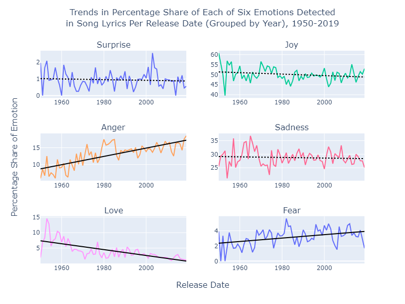

# Performing analysis on lyric data combined with DistilBERT's emotion classification

To view a visualization of the results in Tableau Public, visit this [link](https://public.tableau.com/views/TrendsinPercentageShareofEachofSixEmotionsDetectedinSongLyricsPerReleaseDateGroupedbyYear1950-2019/PercentageShareofEachEmotionOverTime?:language=en-US&:sid=&:redirect=auth&:display_count=n&:origin=viz_share_link).

## Project Overview 

The dataset used in this project is the "Music Dataset: Lyrics and Metadata from 1950 to 2019" by Moura et al. (2020), which consists of music lyrics and metadata on those lyrics spanning nearly seven decades.

For this analysis, we used a pretrained DistilBERT model loaded from the Hugging Face Model Hub. We fine-tuned this DistilBERT model on the "Emotions Dataset for NLP" dataset by Govi (2019), which contains labeled data collected from Twitter, labeled by one of six emotions: "anger", "joy", "surprise", "fear", "love", and "sadness". We then used this fined-tuned model to predict an emotion label for the lyrics of each song in the "Music Dataset: Lyrics and Metadata from 1950 to 2019" dataset.

In this notebook, we take the predictions made by DistilBERT, associate each with its corresponding entry in the original "Music Dataset: Lyrics and Metadata from 1950 to 2019" dataset, and perform a time series analysis on this data. The aim was to see what trends there might have been in the overall emotional content of lyrics released over this time period. 

What we find in this analysis is that songs released in a particular year were increasingly more likely to express "anger" and "fear" and less likely to express "love", as time went on. 

## Set Up

This project uses Python 3.11 for all the code, and both datasets used are listed in the Citations section. Set up a virtual environment with venv and run 

`python -m pip install -r requirements.txt` 

to download all required packages. 

The fastest way to fine-tune the DistilBERT model is to run the train.py script and the fastest way to use the DistilBERT model to make classifications on the lyrics dataset is to run the classify.py script. Make sure to first modify config.yaml before using either script to ensure correct filepaths are used. 

The emotion_classification_with_distilbert.ipynb notebook can also be used for fine-tuning and classification. The notebook is advantageous for visualization and experimentation, though it does take longer to run. 

The analysis is done in the lyric_emotion_analysis_over_time.ipynb notebook. 

## Future Work

Collecting a dataset with a broader and more complex array of emotion classes would be fundamental in arriving at a deeper analysis of the emotional content of lyrics. Additionally, classifying parts of lyrics and capturing the various emotions that can be expressed in a single song would be greatly useful for getting a richer understanding of the complex emotions a single song can express. Because music doesn't only consist of lyrics, collecting a dataset with emotions labeled on other aspects of a song, such as rythm and melody, and using that for analysis alongside NLP emotion classification on lyrics, will enable a broader understanding of the emotions a particular song communicates.    

It would be of interest to look into trends in emotions expressed in music by geographical location, and viewing trends over time lined with other factors that may affect the emotional expression of artists, such as economic conditions over time or other historical developments. 

## Citations

Govi, Praveen. "Emotions Dataset for NLP." Kaggle. Accessed July 11, 2024. https://www.kaggle.com/datasets/praveengovi/emotions-dataset-for-nlp/data.

Moura, Luan; Fontelles, Emanuel; Sampaio, Vinicius; França, Mardônio (2020), “Music Dataset: Lyrics and Metadata from 1950 to 2019”, Mendeley Data, V2, doi: 10.17632/3t9vbwxgr5.2

